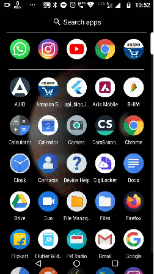

# BLoC Implementation over Instagram Like Application

# About Project

In this Project I tried to implement BLoC to receive data from internet and show it on user interface.
For achieving the purpose, I used Stream, StreamController and Sink.

For Detailed explanation follow me on Medium.com

## Links

https://medium.com/@neeraj.mobcoder

https://www.linkedin.com/in/neeraj-maurya-119425156

https://about.me/nmaurya/getstarted

A new Flutter application.

## Getting Started

This project is a starting point for a Flutter application.

A few resources to get you started if this is your first Flutter project:

- [Lab: Write your first Flutter app](https://flutter.dev/docs/get-started/codelab)
- [Cookbook: Useful Flutter samples](https://flutter.dev/docs/cookbook)

For help getting started with Flutter, view our
[online documentation](https://flutter.dev/docs), which offers tutorials,
samples, guidance on mobile development, and a full API reference.
